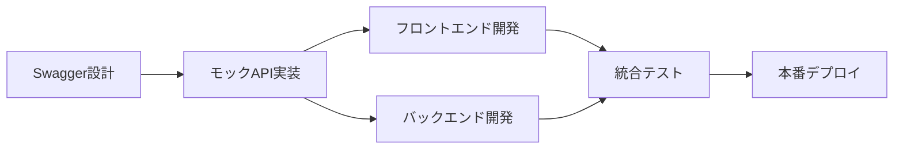

# TONE認証API - チーム開発共有資料

## 📋 目次
1. [プロジェクト概要](#プロジェクト概要)
2. [API仕様書](#api仕様書)
3. [開発環境セットアップ](#開発環境セットアップ)
4. [チーム開発ワークフロー](#チーム開発ワークフロー)
5. [品質管理](#品質管理)
6. [トラブルシューティング](#トラブルシューティング)

---

## 🎯 プロジェクト概要

### プロジェクト情報
- **プロジェクト名**: TONE認証システム
- **開発期間**: 2024年1月〜
- **チーム構成**: フロントエンド2名、バックエンド2名、QA1名
- **技術スタック**: React + TypeScript + Express.js + PostgreSQL

### 開発目標
- ユーザー認証機能の実装
- フロントエンド・バックエンドの並行開発
- API仕様の明確化と品質向上
- 開発効率の最大化

### 成果物
- ✅ Swagger API仕様書（本番用・モック用）
- ✅ モックAPIサーバー
- ✅ Docker Compose統合環境
- ✅ フロントエンド認証機能

---

## 📚 API仕様書

### 利用可能な仕様書

| 仕様書 | 用途 | 対象者 | アクセス方法 |
|--------|------|--------|-------------|
| **本番用API仕様** | 本番環境のAPI設計 | 全開発者 | `swagger.yaml` |
| **モックAPI仕様** | 開発・テスト用 | フロントエンド開発者 | `swagger-mock.yaml` |
| **Swagger UI** | インタラクティブなAPI確認 | 全開発者 | http://localhost:3000/swagger |

### APIエンドポイント一覧

| エンドポイント | メソッド | 認証 | 説明 |
|---------------|----------|------|------|
| `/auth/register` | POST | 不要 | ユーザー登録 |
| `/auth/login` | POST | 不要 | ユーザーログイン |
| `/auth/logout` | POST | 必要 | ユーザーログアウト |
| `/auth/me` | GET | 必要 | ユーザー情報取得 |
| `/auth/health` | GET | 不要 | ヘルスチェック |

### 認証方式
- **JWT（JSON Web Token）**を使用
- ログイン成功時にトークンを発行
- 以降のリクエストで`Authorization: Bearer {token}`ヘッダーを使用

---

## 🛠️ 開発環境セットアップ

### 前提条件
- Docker Desktop
- Node.js 18以上
- Git

### 初回セットアップ（5分で完了）

```bash
# 1. リポジトリクローン
git clone <repository-url>
cd TONE

# 2. 全サービス起動
docker compose --profile mock up

# 3. 動作確認
open http://localhost:5173  # フロントエンド
open http://localhost:3000/swagger  # Swagger UI
```

### 開発用コマンド

```bash
# 全サービス起動
docker compose --profile mock up

# フロントエンドのみ
docker compose up frontend

# モックAPIのみ
docker compose --profile mock up mock-api

# サービス停止
docker compose down

# ログ確認
docker compose logs -f
```

---

## 👥 チーム開発ワークフロー

### 役割別タスク

#### フロントエンド開発者
1. **Swagger UIでAPI仕様確認**
   - http://localhost:3000/swagger にアクセス
   - 各エンドポイントの仕様を確認
   - サンプルリクエストでテスト

2. **フロントエンド実装**
   - `frontend/web/src/hooks/useAuth.ts` でAPI連携
   - モックAPIサーバーで動作確認
   - エラーハンドリング実装

3. **テスト用アカウント**
   ```json
   {
     "email": "test@example.com",
     "password": "password123"
   }
   ```

#### バックエンド開発者
1. **API仕様書の確認**
   - `swagger.yaml` で本番API仕様を確認
   - エンドポイントの実装順序を決定

2. **実装作業**
   - Express.jsでAPIサーバー実装
   - データベース設計・実装
   - 認証・バリデーション実装

3. **テスト**
   - Swagger UIでAPI動作確認
   - フロントエンドとの連携テスト

#### QAエンジニア
1. **APIテスト**
   - Swagger UIで全エンドポイントをテスト
   - エラーケースの確認
   - パフォーマンステスト

2. **統合テスト**
   - フロントエンド・バックエンド連携テスト
   - ユーザーシナリオテスト

### 開発フロー



---

## 🔍 品質管理

### API仕様の品質チェック

#### 必須項目
- [ ] 全エンドポイントの仕様が明確
- [ ] リクエスト・レスポンス例が記載
- [ ] エラーレスポンスが定義
- [ ] 認証要件が明記

#### 推奨項目
- [ ] バリデーションルールが詳細
- [ ] セキュリティ要件が記載
- [ ] パフォーマンス要件が明記

### コードレビュー項目

#### フロントエンド
- [ ] API呼び出しがSwagger仕様通り
- [ ] エラーハンドリングが適切
- [ ] 型定義が正確

#### バックエンド
- [ ] API実装がSwagger仕様通り
- [ ] セキュリティ対策が実装
- [ ] データベース設計が適切

---

## 🚨 トラブルシューティング

### よくある問題と解決方法

#### 1. モックAPIサーバーが起動しない
```bash
# ログ確認
docker compose logs mock-api

# ポート確認
lsof -i :3000

# 再ビルド
docker compose build mock-api
```

#### 2. フロントエンドからAPIに接続できない
```bash
# ネットワーク確認
docker network ls
docker network inspect tone_tone-network

# CORS設定確認
# mock-server.jsのcors設定を確認
```

#### 3. Swagger UIが表示されない
```bash
# ファイル確認
ls -la swagger-mock.yaml

# 直接アクセス
curl http://localhost:3000/swagger.yaml
```

### デバッグ用コマンド

```bash
# 全サービスの状態確認
docker compose ps

# 特定サービスのログ確認
docker compose logs frontend
docker compose logs mock-api

# コンテナ内でコマンド実行
docker compose exec mock-api sh
docker compose exec frontend sh
```

---

## 📞 サポート・連絡先

### 技術的な質問
- **Slack**: #tone-api-development
- **GitHub Issues**: [プロジェクトのIssuesページ]
- **ドキュメント**: [APIドキュメント]

### 緊急時連絡先
- **プロジェクトリーダー**: [連絡先]
- **技術リーダー**: [連絡先]

---

## 📅 今後の予定

### 短期目標（1-2週間）
- [ ] 本番APIサーバーの実装
- [ ] データベース設計・実装
- [ ] セキュリティ強化

### 中期目標（1ヶ月）
- [ ] CI/CDパイプライン構築
- [ ] 自動テスト実装
- [ ] パフォーマンス最適化

### 長期目標（3ヶ月）
- [ ] マイクロサービス化
- [ ] 監視・ログシステム構築
- [ ] 本番環境での運用開始

---

## 📝 更新履歴

| 日付 | 更新者 | 内容 |
|------|--------|------|
| 2024-01-XX | [名前] | 初版作成 |
| 2024-01-XX | [名前] | Swagger仕様追加 |

---

**この資料は随時更新されます。最新版は常にリポジトリで確認してください。** 